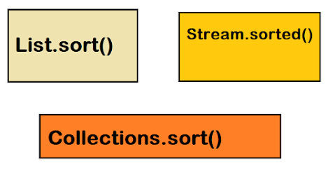
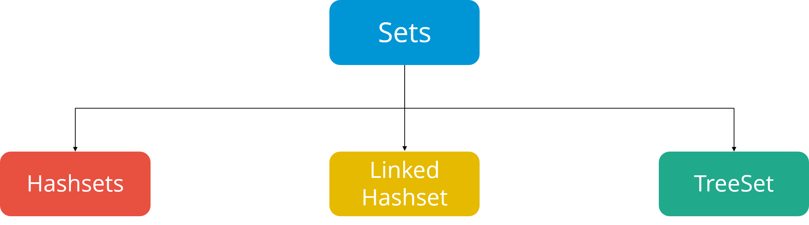
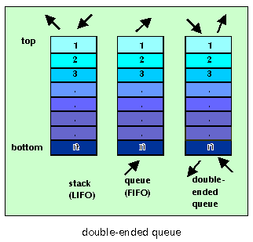
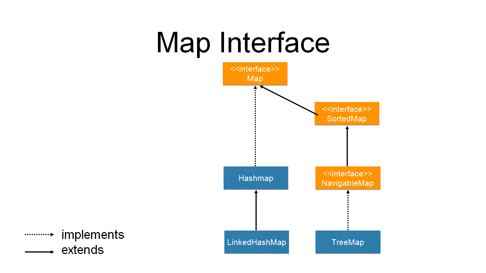
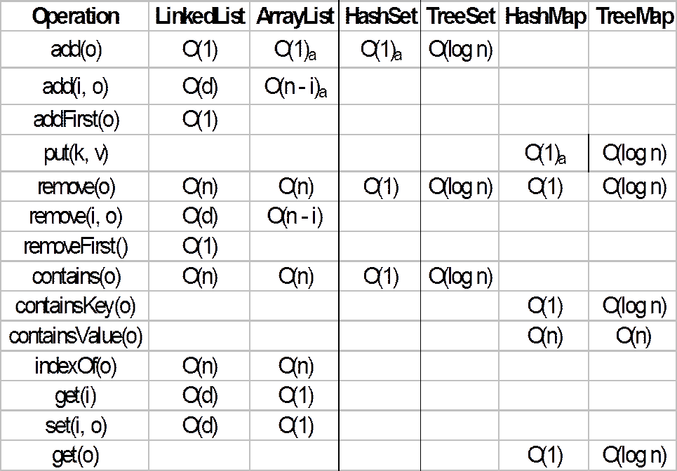

# Lists


lists are **ordered**,
1. means they have indexes, they are ordered by the
2. means they can be sorted by same condition too


```java
 List al1 = new ArrayList();
        al1.add("Aram");
        al1.add("admin");
        al1.add("Ararat");
        al1.add(777);
        
 Collections.sort(al1);
        System.out.println(al1);//[Hero, admin, Aram, 777]
        
 al1.remove(3); // integer can't sort with String
 Collections.sort(al1);
        System.out.println(al1);//[Aram, admin, Hero]

```
Sorting for Object ArrayList
```java
List<Book> books = Arrays.asList(new Book("Heminguey", 1001), new Book("Anatol", 1002));
Collections.sort(books, comparator);
//Sort with Lyambda comparator example
Collections.sort(books, (o1, o2) -> o2.price - o1.price);
```

```java
List<String> names = Arrays.asList("James", "Mary", "Ken", "Joe");
names.sort(Comparator.reverseOrder());
```
example with employee class objects collection
```java
employees.sort(Comparator.comparing(Person::getName)
                         .thenComparing(Person::getAge));
```
also, we can update List element by set() method, which don't have Set collections
# Sets

1. Sets don't have **duplicate** elements (if you write such code, won't give any exception or error, just nothing will be added).



HashSet - Not Sorted, Not ordered.
and we need to override equals and hashcode methods for check ``` set.contains(new person("Jon","25")) ```, otherwise he considered not equal object with same parameters 

LinkedHashSet - Not Sorted, Has elements adding order and impossible to change it.

TreeSet - Can't be unSorted(if you add not numeric or String object you have to define compilation rule), ordered by sorted condition, impossible other way order unlike lists by index
```java
 new TreeSet(comparator)
// or your set objects class make comparable(by implementing comparable interface and overwriting compareTo method comparing rule).
```
#Que and Deque

A **queue** is a linear data structure or a collection in Java that stores elements in a **FIFO** (First In, First Out) order. similar vector.

A **deque** is a double-ended queue. It FIFO + **LIFO**, can use like a vector and stack.


#Maps

- HashMap: Doesn't maintain any order.
- LinkedHashMap: Maintains insertion order.
- TreeMap: Maintains natural order.
- ~~Hashtable~~: is obsolete. 




# Collections diagrams



-shortly.jpg)